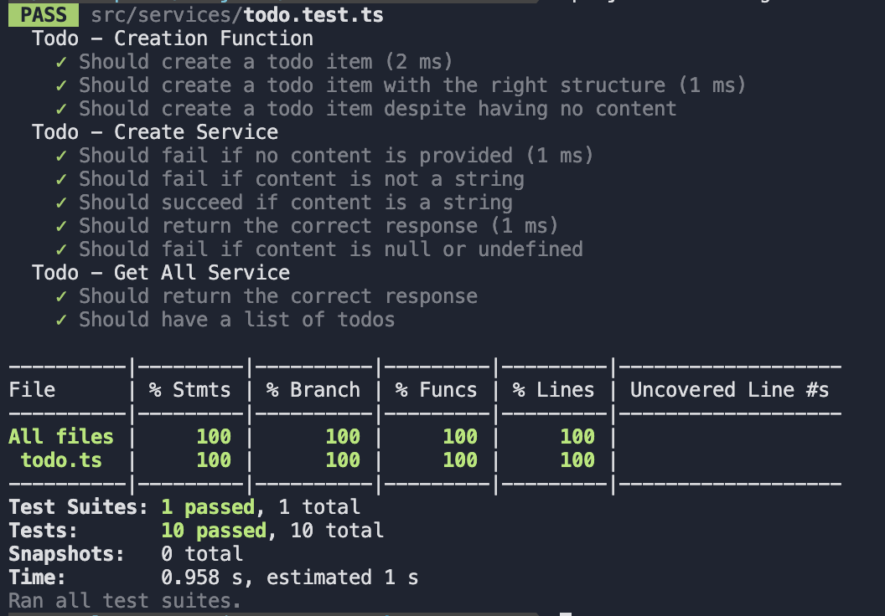

# Todo Application

### Overview

This todo list project had a <strong>2 hour time limit.</strong>

#### Functional requirements:

-   Allow users to add a new todo item.
    -   Data model: {UUID, createdAt, content}
    -   Content cannot be blank.
-   Allow a user to get a list of todos.

#### Non-Functional requirements:

-   Use TypeScript, Node and in-memory storage.
-   Expose a REST API interface.
-   Write unit tests to test critical parts of the application.
-   Prepare a Dockerfile to run the application.
-   Create a README.md file to state instructions and include a screenshot of test coverage.

### Building

To build the docker image, execute the following command from the inside the project's directory:

`docker build -t todo-app .`

### Running

To run the image as a container with a name of 'todo', run the following command:

`docker run -p 3000:3000 --name todo todo-app`

### Test results

